  <table style="border: none;">
    <tr>
      <td align="center" style="border: none;">
        <b>📱 MOBILE (CORE)</b>  
        
      </td>
    </tr>
  </table>
  
  <table style="border: none;">
    <tr>
      <td align="center" style="border: none;">
        <b>💻 WEB, BACKEND & DESKTOP</b>  
        
      </td>
    </tr>
    <tr>
      <td align="center" style="border: none; padding-top: 20px;">
        <b>⚙️ TOOLS</b>  
        
      </td>
    </tr>
  </table>

  

    <!-- Estatísticas do Wakatime -->
    
    <!-- Estatísticas do GitHub -->
    
  

---

### 📊 GitHub Stats

  
  

---

### 🔥 Contribution Streak

---

### ⏲ WakaTime Stats

---

<picture align="center">
  <source media="(prefers-color-scheme: dark)" srcset="https://raw.githubusercontent.com/Franklyn-R-Silva/Franklyn-R-Silva/output/github-contribution-grid-snake-dark.svg">
  <source media="(prefers-color-scheme: light)" srcset="https://raw.githubusercontent.com/Franklyn-R-Silva/Franklyn-R-Silva/output/github-contribution-grid-snake-dark.svg">
  
</picture>

